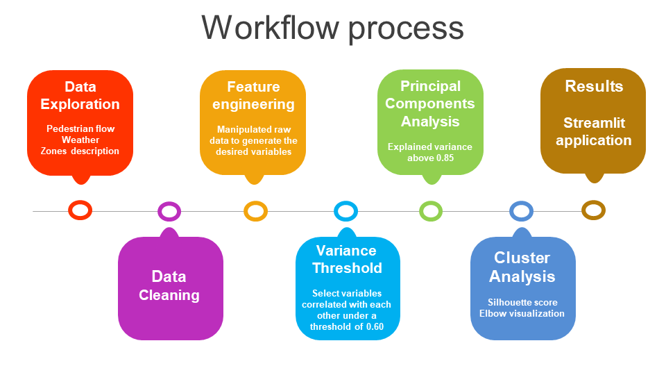

# Project-Hub

### Mission 
Describe the dynamic of the neighbourhoods and be able to make a profile of them. 

### Description
The project is based on explore the data, feature engineering, build an unsupervised machine learning model and build an interactive app.

#### Datasets:
Pedestrian flow  
Weather   
Zones description   

### Installation
Create an virtual environment and install the libraries on the requirements.txt 
pip install requirements.txt .

### Workflow

