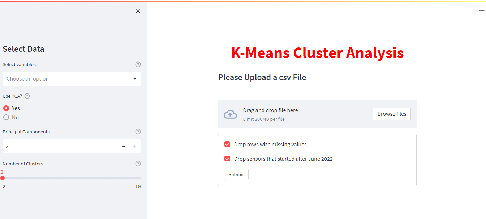
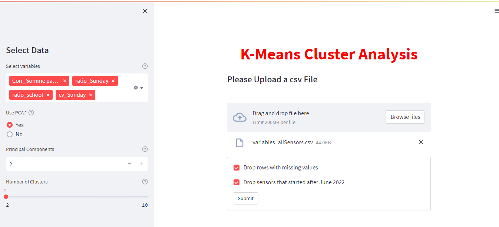
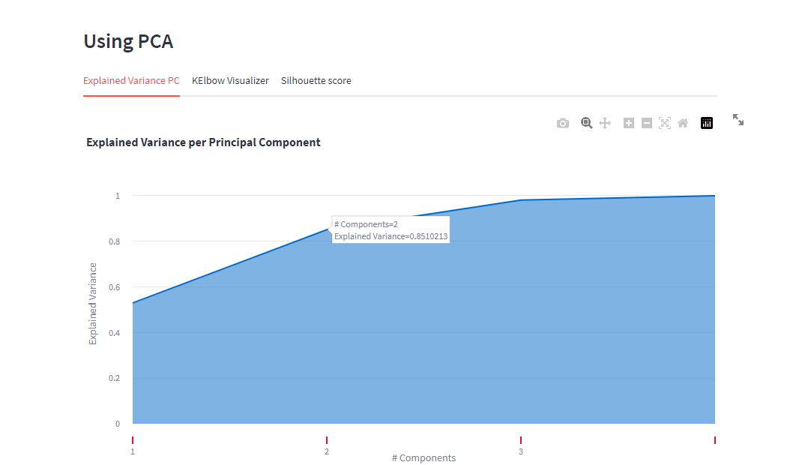
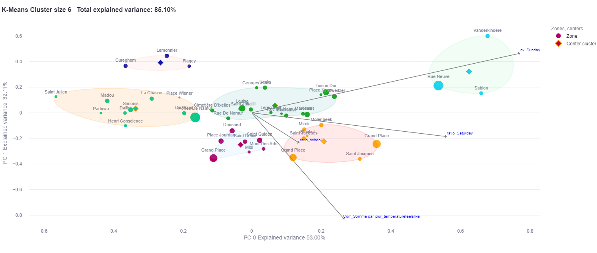

# Project-Hub

## Mission 
Describe the dynamic of the neighbourhoods and be able to make a profile of them. 

## Description
The project is based on explore the data, feature engineering, implement an unsupervised machine learning model and build an interactive app.

### Datasets:
+ Pedestrian flow  
+ Weather   
+ Zones description   

## Installation
Create an virtual environment and install the necessary libraries:
- Numpy 
- Pandas 
- Plotly
- Pyxlsb
- Matplotlib 
- Scipy 
- Sklearn
- Streamlit 
- Streamlit_ext
- Random
- Yellowbrick 

Or you can install the libraries on the requirements.txt from your terminal:

`pip install requirements.txt`.

## Workflow

## App
To run the app use `streamlit run app.py` from the terminal and your directory.

As soon as you run the script, a local Streamlit server will spin up and your app will open in a new tab in your default web browser.  
  
Data Exploration.

Data Cleaning: 
   - Remove outliers
   - Data since Febreruary 2022.

Feature Ingeneering:
   - Selected, transformed, extracted, combined, and manipulated raw data to generate the desired variables for analysis or predictive modeling.
   - More than 40 variables were created.

Variance Threshold:
   -

   
   
You can upload the file with the variables and select variables.

In case you have selected PCA, in the first section, you can visualize the following three plots:

- Explained Variance PC
- KElbow Visualizer
- Silhouette score

Otherwise, will be only displayed the last two ones.   

Example:   

  
  
  

In the next part, you will see the clusters visualizations. 

    
  
  
You can save the image and download the data. 
This image shows the proposed clustering using the K-Means algorithm.  
  
      

## Learned lessons

I gain more coding and plotting experience.

