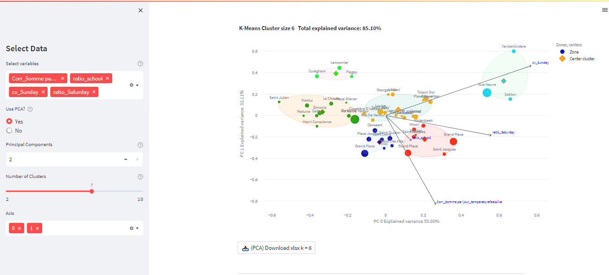

# Project-Hub

## Mission 
Describe the dynamic of the neighbourhoods and be able to make a profile of them. 

## Description
The project is based on explore the data, feature engineering, implement an unsupervised machine learning model and build an interactive app.

### Datasets:
+ Pedestrian flow  
+ Weather   
+ Zones description   

## Installation
Create an virtual environment and install the necessary libraries:
- Numpy 
- Pandas 
- Plotly
- Pyxlsb
- Matplotlib 
- Scipy 
- Sklearn
- Streamlit 
- Streamlit_ext
- Random
- Yellowbrick 

Or you can install the libraries on the requirements.txt from your terminal:

`pip install requirements.txt`.

## Workflow
  
Data Exploration.  

Data Cleaning: 
   - Remove outliers
   - Data since February 2022.

Feature Engineering:
   - Selected, transformed, extracted, combined, and manipulated raw data to generate the desired variables for analysis or predictive modelling.
   - More than 40 variables were created.

Variance Threshold Analysis:
  - Remove highly correlated variables.

Principal Components Analysis.  
  - Dimensionality-reduction method.
  - Two Principal Components that explain the variance above 85%.
  
Cluster Analysis.  
  - K-Means Algorithm.
  
App.  
  - Streamlit app.

  

## App  

To run the app use `streamlit run app.py` from the terminal and your directory.

As soon as you run the script, a local streamlit server will spin up and your app will open in a new tab in your default web browser.  

   
   
You can upload the file with the variables and select variables.

In case you have selected PCA, in the first section, you can visualize the following three plots:

- Explained Variance PC
- K Elbow Visualizer
- Silhouette score

Otherwise, will be only displayed the last two ones.   

Example:   

  
  
  

In the next part, you will see the clusters visualizations. 

    
  
  
You can save the image and download the data. 
This image shows the proposed clustering using the K-Means algorithm.  
  
      

## Conclusion:  

After have been working in this project for three months, we found interesting insights, and reach the goal.   

The app is ready to use locally. The user can add more variables and play with the it.

## Learned lessons

Work towards specific goals in a short period of time.  

Plot using plotly express.  

Build a streamlit application.  
  
    
  
  

